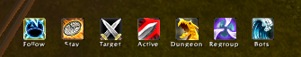

# SquidBots Lite

A World of Warcraft 3.3.5 addon for [CoA Bots](https://github.com/Zyth45/mod-playerbots): your bots, without a window in the way.

No window. A thin bar of buttons, the bots' roles drawn straight onto the party frames you already have, and offers arriving as small toasts.



## The bar

Six orders, one click each: **Follow**, **Stay**, **Attack my target**, **Active / Passive**, **Dungeon**, **Regroup**. Dungeon mode keeps bots with you, out of the stuff on the ground, and pulling when you pull. Regroup teleports every bot next to you, for the one stuck behind a wall.

The Active / Passive button shows where the bots stand: a charge arrow and *Active* while they fight, **Zzz** and *Passive* while they hold back. Passive also stops the tank pulling on its own; any order wakes them all.

When a bot dies, a **Release** button shows up at the end of the bar: dead bots release their spirit and run back to their body.

Right-click the bar for profiles: **Farm** (hunt, loot, eat), **Strict follow**, **Dungeon**, plus two submenus:

- **Orders by role**: tank attacks my target, damage attacks my target, healers follow me or stay here, melee back to me, holding fire until the next order.
- **Formation**: close, line, circle, shield around me, arrow, single file.

Shift-drag a button to move the bar.

## Key bindings

Follow, Stay, Attack, Passive, Dungeon, Regroup and Release can each get a key: Esc > Key Bindings > SquidBots Lite. The keys work with the bar hidden.

## Asking for bots

The **Bots** button asks for a **tank**, a **healer**, **damage**, or all three. It types `lfg bot` in your Zone or Newcomers channel, exactly as you would. Free bots answer with an offer, shown as a toast above the bar with an **Invite** button.

GMs can switch to `.playerbots coa` with `/sbl gm` and skip the channel.

## On your party frames

Each bot gets a role icon on its frame. Click it for that bot alone: come to me, stay here, attack my target, stats, best gear, remove from group. A tank adds auto pull on or off; a healer adds **Heal only me** (for a duo) and **Heal the whole group**.

A bot you invited by hand, not through `lfg bot`, is asked `co ?` once to learn its role; the question and its answer stay out of your chat. `/sbl roles off` turns that off (a human player in your group would get that one whisper too). The frames also show **Low mana**, **Pulling** and **Rez** without a word of chat.

## Commands

```
/sbl                 show or hide the bar
/sbl lang fr | en    French or English
/sbl channel <name>  ask in a different channel (a name, not a number)
/sbl roles on | off  ask bots of unknown role for it
/sbl gm              GM mode
/sbl reset           put the bar back in the middle
```

## Install

It ships with CoA Bots, whose installer copies it into your client. To install it by hand, copy the `SquidBotsLite` folder into `Interface/AddOns`.

Everything it sends is a chat command mod-playerbots already understands: it never asks the server for anything a player could not type.

## Changes

**1.5**
- Regroup button (`summon`): every bot teleports next to you.
- Release button, shown only while a bot lies dead.
- Right-click menu: orders by role (`@tank`, `@dps`, `@heal`, `@melee`) and formations.
- Bot menu: stats and best gear for every bot; *Heal only me* and *Heal the whole group* for healers.
- Roles of bots invited by hand, learnt quietly with `co ?` (`/sbl roles off` to stop).
- Key bindings for the seven orders.
- The Active / Passive button shows the bots' state, and Passive stops the tank's auto pull: a passive tank used to pull a pack, then stand there.
- Fixed: any order now wakes passive bots (Attack was ignored), and the Dungeon button follows the profiles menu.

**1.4**
- First public release.

## Related

- [mod-playerbots, CoA Bots branch](https://github.com/Zyth45/mod-playerbots)
- [SquidBots dashboard](https://github.com/Zyth45/squidbots-dashboard)

## License

GPL-2.0, see [LICENSE](LICENSE).
